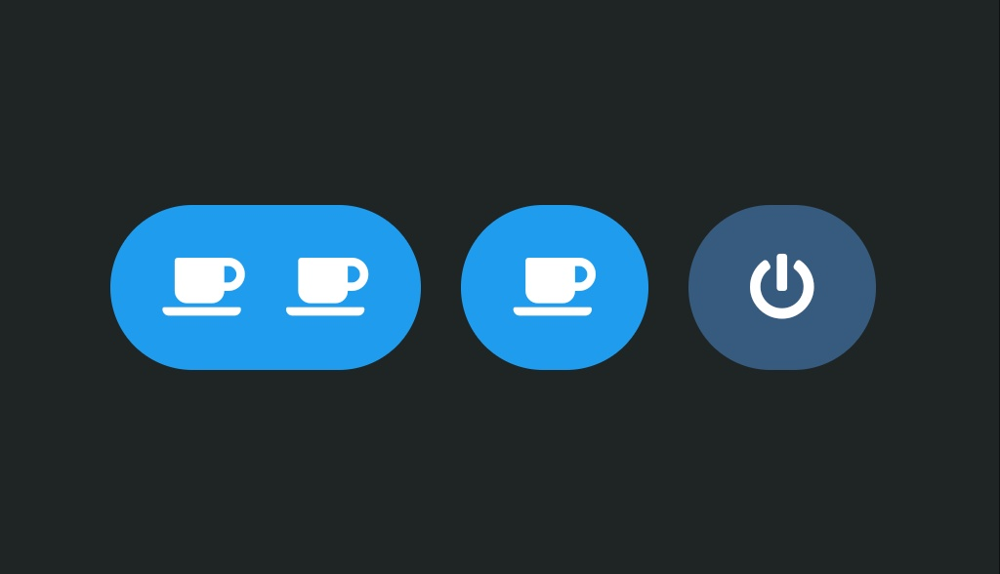

# Work In Progress
I'll write a proper blog post about this, please come back at a later date.

# What is this
I hacked my coffee machine to serve me coffee via a beautiful web interface.

## Demo 

## Blogpost
`<INSERT LINK HERE>`

## GPIO Schema
- `GPIO2` => `Toggle power`
- `GPIO3` => `Brew one cup`
- `GPIO4` => `Brew two cups`
